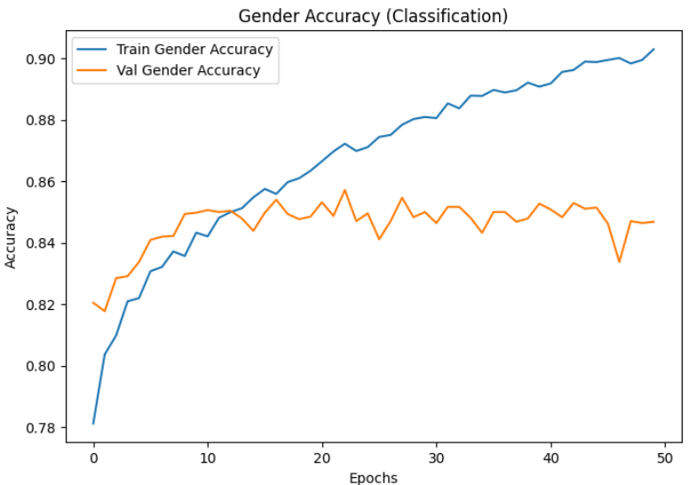
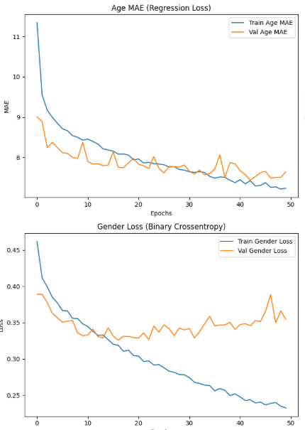
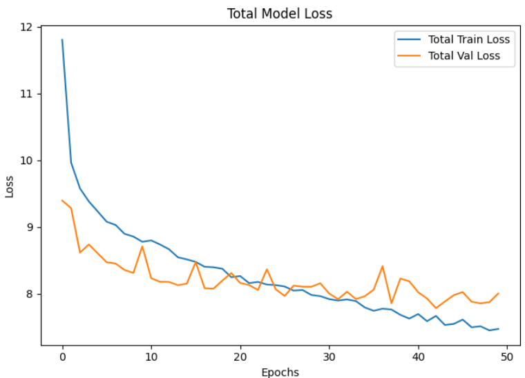
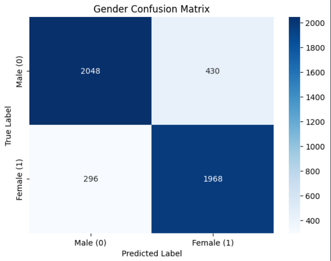
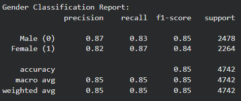

# Senior Citizen Identification System

**This project is an extension of my training project [Your Training Project Name Here], submitted for the [Internship Name] internship.**

## Problem Statement

This project implements a real-time system to detect persons in a video feed, identify their age and gender, and flag individuals over 60 as "Senior Citizens." All detections of senior citizens are logged with a timestamp, age, and gender into a `.csv` file.

This system builds on my training project by [Explain how it connects, e.g., "by taking the CNN classification skills I learned and applying them to a more complex, multi-output, real-time detection pipeline."].

## Methodology

The system works as a two-stage pipeline:

1.  **Face Detection:** I used a pre-trained SSD-based (Single Shot Detector) face detector from OpenCV's DNN module to find all faces in a frame.
2.  **Age & Gender Classification:** I "created my own model" by fine-tuning a pre-trained **MobileNetV2** (or ResNet, etc.) on the **UTKFace dataset**.
    * The original classification head was removed and replaced with two separate output heads: one for gender (binary classification) and one for age (regression).
    * The notebook used for this training can be found here: [Link to your public Model_Training.ipynb notebook].
3.  **Logging:** A Python script using OpenCV captures video, runs the pipeline on each frame, and logs all senior citizen data. The results are saved to `senior_citizen_log.csv` using Pandas.

## Dataset

This project uses the public UTKFace dataset as the labeled face corpus for training the age (regression) and gender (binary classification) heads.

- Dataset contents: UTKFace contains thousands of face images covering a wide age range (commonly 0–116 years). Images vary in resolution and lighting conditions and were collected for academic research on age, gender and race estimation.
- Filename format: labels are encoded in each filename using the format:

    `[age]_[gender]_[race]_[date].jpg`

    - age: integer age (e.g., 25)
    - gender: 0 = male, 1 = female
    - race: integer code (see the original UTKFace documentation for the exact race mapping)

    Example filenames:

    - `25_0_2_20170116174525125.jpg`  (25 years old, male, race code 2)
    - `60_1_0_20161219234512345.jpg`  (60 years old, female, race code 0)

- Preparation: download and extract the UTKFace images into the repository root folder named `UTKFace/` so that images are accessible at `UTKFace/<image_file>.jpg`. The training script (`model_training.py`) expects this path by default.
- Notes: the training script filters out invalid ages and keeps images with ages in the range 1–116. Check filenames carefully — the code assumes the label parts are present and separated by underscores.
- License & source: UTKFace is a publicly available dataset used for academic purposes. Please refer to the original UTKFace source or mirror for licensing details and cite appropriately when required.

## Results

* **Age Model (MAE):** The fine-tuned model achieved a Mean Absolute Error of **[Your MAE, e.g., 3.8] years** on the validation set.
* **Gender Model (Accuracy):** The model achieved **[Your Accuracy, e.g., 96%]%** accuracy on the validation set.
* **Real-Time Performance:** The system runs at approximately [Your FPS, e.g., 10-15] FPS on a [Your CPU/GPU] CPU.

*(Insert a screenshot or GIF of your project working here)*

## Model metrics & reports

When you run the training script (`model_training.py`) it computes and saves useful evaluation artifacts for both the age regression and gender classification tasks. The training script produces the following files inside a `reports/` directory (created automatically):

### Gender Model Accuracy

---
### Gender & Age Model Loss

---
### Total Model Loss

---
###  Model Confusion Matrix

---
### Model Classification Report

---
How to generate these files

1. Ensure the UTKFace dataset is extracted to the `UTKFace/` folder and dependencies are installed:

```bash
pip install -r requirements.txt
```

2. Run the training script (this will train the model and write the reports):

```bash
python model_training.py
```

3. After training completes you can open the `reports/` folder to view the plots and CSVs. Example quick checks in Python:

```python
import pandas as pd
pd.read_csv('reports/training_history.csv').tail()

# Print classification report
print(open('reports/gender_classification_report.txt').read())
```

Notes on interpretation

- Accuracy: check `final_gender_val_acc` in `reports/final_metrics_summary.csv` and the plotted validation accuracy curve in `training_history.png`.
- Loss: review `val_loss` (and per-head losses) in `training_history.csv` and the PNG plot.
- Classification report: contains precision, recall and f1-score per class (Male/Female). Use this to evaluate class-wise performance.
- Confusion matrix: shows the count of true vs predicted classes — useful to see systematic misclassification.

If you'd like, I can add example screenshots or embed the latest classification report and confusion matrix directly into this README once you've run training and share the resulting files here.

## How to Run

1.  Clone the repository:
    ```bash
    git clone [Your Repo URL]
    cd senior-citizen-detection-project
    ```
2.  Install dependencies:
    ```bash
    pip install -r requirements.txt
    ```
3.  Run the application (on webcam):
    ```bash
    python main.py
    ```
4.  Press 'q' to quit. The `senior_citizen_log.csv` file will be generated in the root directory.